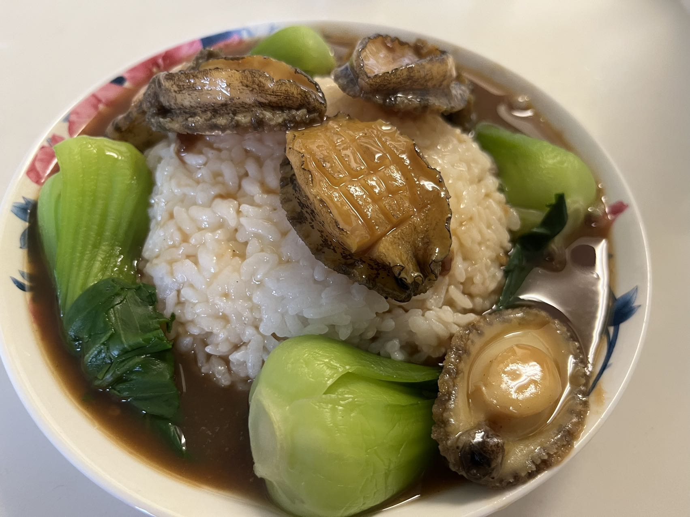

import ReactPlayer from 'react-player'

> The taste from the ocean floor of the deep sea, mixed with the fresh green from the primal land, combine to produce a masterwork of delicacy.

### Abalone Rice 鲍鱼捞饭

### Ingredients

- Abalone x6 鲍鱼
- Bok Choy/asparagus x4 小青菜/芦笋
- A bowl of cooked white rice 米饭
- 1 teaspoon of oyster sauce 蚝油
- 2 teaspoons of soy sauce 生抽
- 1 teaspoon of old soy sauce 老抽
- 2 teaspoons of cooking wine 料酒
- 2 teaspoons of starch 淀粉
- 1 slice of ginger 姜
- A little bit of white pepper 白胡椒

### Instructions

1. Clean the abalones and cut grid-like patterns on the surface.
2. Put cooking wine and white pepper to marinate them for 30 min.
3. Start boiling some water and put a slice of ginger and a little more cooking wine in it.
4. When the water is boiling, put the abalones in and take them out after 3 min.
5. Put bok choy in the water afterward and take them out after they're cooked.
6. Put all the sauces listed and starch in. Add more water if needed.
7. Wait until the mixture becomes sticky and the volume shrinks to the desired size.
8. Put the abalones back in and turn off the heat.
9. Arrange rice and bok choy and pour the abalones + sauce onto them.
10. Done and enjoy!

:::tip

Don't overcook the abalones. 3 minutes should be enough for small ones.

:::

### Adornment

<ReactPlayer controls url='/myWiki/vid/abalone_rice.mp4' />