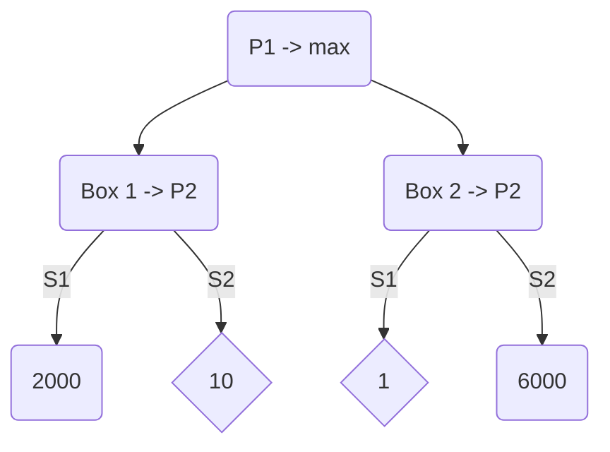
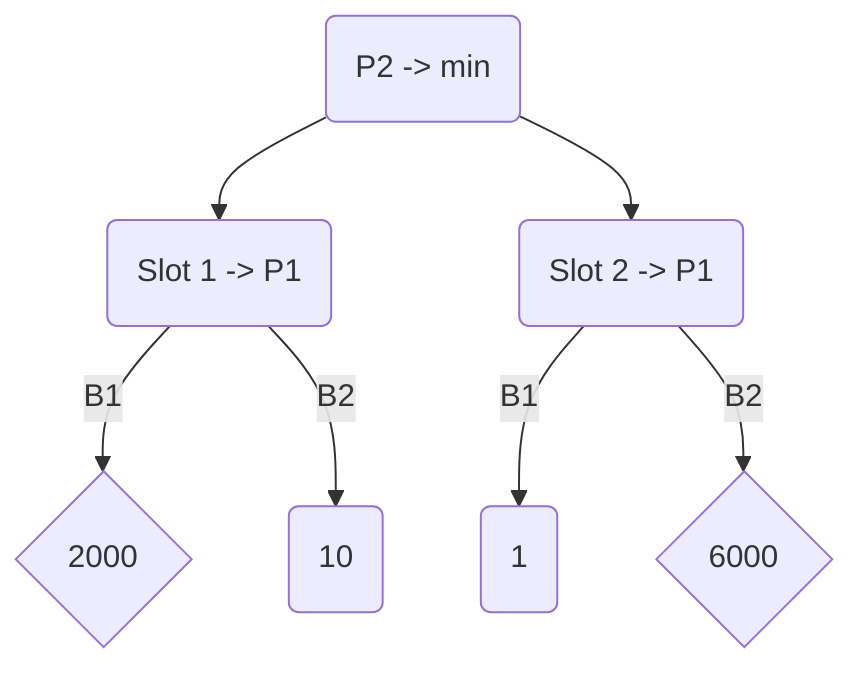

---

So far we have chatted about optimal control problems in the absence of any uncertainty. However, as we discussed earlier, real-world systems often have some uncertainty. So let's add back uncertainty in our optimal control discussion. We will primarily deal with non-deterministic uncertainty, where $d \in [\underline{d}, \bar{d}]$.

In the presence of uncertainty, the optimal control problem is often formulated as a robust optimal control problem, where uncertainty ties to maximizing the cost whereas the control wants to minimize the cost. We will discuss the problem in continuous time, the discrete-time formulation can be similarly defined:

:::info Robust Optimal Control Problem

$$
\begin{array}{rlrl}
\min_{u(\cdot)} \max_{d(\cdot)} & J(x(t), u(\cdot), d(\cdot), t) & \equiv V(x, t) \\
s. t. & \dot{x}(s) =f(x(s), u(s), d(s)) & \\
& \underline{u} \leq u(s) \leq \bar{u} & \forall s \in[t, T] \\
& \underline{d} \leq d(s) \leq \bar{d}
\end{array}
$$

:::

- In the above problem, control is trying to minimize the cost function and disturbance is trying to maximize it. In other words, the control is optimizing the **worst-case cost**.

- Note that we have modeled uncertainty as if it is working adversarially against us; however, the real world does not behave this way. This choice is made because we don't know what uncertainty we might face and hence if we plan against worst-case uncertainty, we can always ensure good performance.

- The above problem is a game between the control and the disturbance since their decisions are intertwined (through dynamics). Since control and disturbance are a function of time, it is a dynamic game. Finally, since the cost function for disturbance is negative of that of control, it is a zero-sum game. Thus, the robust optimal control problem is an instance of a **zero-sum dynamic game problem**.

- Zero-sum dynamic games have been studied extensively by Rufus Isaac who came up with a "dynamic programming" principle for zero-sum games. In fact, there has been some dispute about the original founder of dynamic programming.

    Rufus was studying these games in the context of pursuit-evasion games where the goal of the pursuer (disturbance) was to chase an evader vehicle (control) who was trying to escape the pursuer.

### Importance of Information Pattern

When we have two players that are playing against each other, their optimal strategy will depend on what information each has access to. To understand this, consider the following example:

#### Case 1

Suppose there are two boxes each with two slots. Each slot contains some prize money. Player 1 wants to maximize its prize money whereas Player 2 who has to pay this prize money wants to minimize the prize money of Player 1.

If P1 picks Box 1, P2 picks Slot 2. Reward -> 10

If P1 picks Box 2, P2 picks Slot 1. Reward -> 1

The best outcome of the game for P1 is to pick Box 1 and get a reward of 10. Mathematically, this is written as:

$$
\max_{u\in [B1,B2]}\left(\min_{d\in [S1, S2]} J(u, d) \right) = 10
$$

#### Case 2

Suppose P2 goes first:

If P2 picks Slot 1, P1 will pick Box 1. Reward -> 2000

If P2 picks Slot 2, P1 will pick Box 2. Reward -> 6000

The best strategy for P2 is to pick Slot 1 and pay P1 a reward of 2000. Mathematically, this is written as:

$$
\min_{d\in [S1, S2]}\left(\max_{u\in [B1,B2]} J(u, d) \right) = 2000
$$

Clearly, the outcome of the game depends on when and on what information each player decides in his or her input. In general, whenever we have some $\max \min J(\cdot)$. $\max$ is computed second, but plays first, and $\min$ is computed first, but plays second.

The same order and information aspects are important for our zero-sum dynamic games. In addition to the order of play, it is also important as to what information each agent has when they are making their decision at some time $s\in [s, T]$.

#### Example 2

To understand this, let's again consider an example:

Here, $u$ wants to reach G1 or G2 without being intercepted by $d$. On the other hand, $d$ wants to intercept $u$.

#### Open-loop Formulation

1. $\min_{u(\cdot)} \max_{d(\cdot)} J(\cdot) \rightarrow$ an objective that combines distance to the goals while avoiding collision.

    

    

    

    $u(\cdot)$ will declare its trajectory first. $d(\cdot)$ will then try to intercept this trajectory. $\rightarrow$ *Overly pessimistic*

2. $\max_{d(\cdot)} \min_{u(\cdot)} J(\cdot)$

    

    

    

    $d(\cdot)$ will first declare its interception route. $u(\cdot)$ can then move to the opposite goal. $\rightarrow$ *Overly optimistic*

#### Closed-loop Formulation

The above formulations are not suitable to describe most practical systems. Typically, at time $t$, we only have information up to time $t$. Such strategies are called non-anticipative strategies.

$$
V(x, t)=\min _{u(\cdot) \in \Gamma_u} \max _{d(\cdot) \in \Gamma_d} J(x(t), u(\cdot), d(\cdot), t)
$$

In this case, $u(\cdot)$ does not need to commit left or right beforehand. Hence, $d(\cdot)$ cannot simply intercept $u(\cdot)$ before it reaches the goal.

$$
\begin{aligned}
\Gamma_d(t, t_1)=\{ & \delta[u](s): \mathbb{U}_t^z \rightarrow \mathbb{D}_t^z \text { s.t. if } \forall u_1(\cdot), u_2(\cdot) \\
& \forall z \in[t, t_1] \quad u_1(z)=u_2(z) \text { a.e. } \Rightarrow \delta\left[u_1\right](z)=\delta\left[u_2\right](z) \\
& \text { a.e. for } \forall z \in\left[t, t_1\right]\} \\
\end{aligned}
$$

### Robust Value Function

Under non-anticipative strategies, it can be shown that the value function exists. The robust function can be obtained by applying the principle of dynamic programming as before. Specifically,

$$
\begin{aligned}
V(x, t)= & \min _{u(\cdot) \in \Gamma_u} \max _{d(\cdot) \in \Gamma_d} J(x, u(\cdot), d(\cdot), t) \\
= & \min _{u(\cdot) \in \Gamma_u} \max _{d(\cdot) \in \Gamma_d}\{L(x, u(t), d(t)) \delta+V(x(t+\delta), t+\delta)\}
\end{aligned}
$$
As before, if we simplify $V(x(t+\delta), t+\delta)$, we get:

:::info Hamilton-Jacobi Isaacs (HJI) equation

$$
\begin{gathered}
\frac{\partial V(x, t)}{\partial t}+\min _{u(t)} \max _{d(t)}\left\{L(x, u(t), d(t))+\frac{\partial V(x, t)}{\partial x} \cdot f\left(x, u, d\right)\right\}=0 \\
V(x, T)=l(x)
\end{gathered}
$$

:::

The HJI equation looks very similar to the HJB equation with the min operator replaced by the min-max operator.

The tools that are available to solve the HJB equation can also be used to solve the HJI equation (at least most of them can be used).

### Demo

- Dynamics:
    $$
    \begin{aligned}
    & \dot{p}_x=v_x+d_x \\
    & \dot{p}_y=v_y+d_y
    \end{aligned}
    $$
- Control:
    $v_x, v_y ;\left|v_x\right|,\left|v_y\right| \leq 1 \mathrm{~m} / \mathrm{s}$
- Uncertainty/Disturbance: $d_x, d_y ;\left|d_x\right|, \left|d_y\right| \leq 0.2 \mathrm{~m} / \mathrm{s}$

#### Cost Function

$$
\begin{aligned}
J(x, u(\cdot), d(\cdot), t) = & \int_{s=t}^T \left(\operatorname{dist}^2(x(s), \text{ goal}) + \lambda \cdot \text{obs-penetration} (x(s)) \right)d s \\
& + \left(\operatorname{dist}^2(x(T), \text{ goal})+\lambda \cdot \text{obs-penetration} (x(T))\right) \\
\operatorname{dist}^2(x(s), \text{ goal }) = & \left(p_x(s)-x_g\right)^2+\left(p_y(s)-y_g\right)^2 \\
\text{obs-penetration}_{x(s)} = & \max\{0, s_{obs} - \sqrt{(p_x(s)-x_{obs})^2 + (p_y(s) - y_{obs})^2} \}
\end{aligned}
$$

#### Terminal Value Function

$$
\begin{aligned}
V(x, T) & =l(x) \\
& =\operatorname{dist}^2(x, \text { goal})+\lambda \cdot \text {obs-penetration}(x)
\end{aligned}
$$

### Hamiltonian Computation

$$
H(x, V(x, t))=\min_{v_x, v_y} \max_{d_x, d_y}\{L(x, u, d)+\frac{\partial v}{\partial x} \cdot f(x, u, d)\} \\
L(x, u, d)=L(x)=\operatorname{dist}^2 (x, \text{goal}) + \lambda \cdot \text{obs-penetration}(x)
$$

Since $L$ does not depend on $u$ and $d$, we can re-write Hamiltonian as:
$$
H\left(x, V\right)=L(x)+\min_{v_x, v_y} \max_{d_x, d_y}\left\{\frac{\partial v}{\partial x} \cdot f(x, u, d)\right\}
$$
Let $\frac{\partial v}{\partial x}=\left(p_1(x) \quad p_2(x)\right)$. Then,

$$
\begin{aligned}
H(x, V)&=L(x)+\min_{v_x, v_y} \max_{d_x, d_y}\left(p_1 v_x+p_1 d_x+p_2 v_y+p_2 d_y\right) \\
& =L(x)+\min_{v_x} p_1 v_x+\max_{d_x} p_1 d_x+\min _{v_y} p_2 v_y+\max_{d_y} p_2 d_y \\
& \text{ (This can be done since $v_x, v_y, d_x, d_y$ teams are replaceble) } \\
& =L(x)-\left|p_1\right| v_{\max }+\left|p_1\right| d_{\max }-\left|p_2\right| v_{\max }+\left|p_2\right| d_{\max } \\
& =L(x)+\left(\left|p_1\right|+\left|p_2\right|\right)\left(d_{\max }-v_{\max }\right)
\end{aligned}
$$
